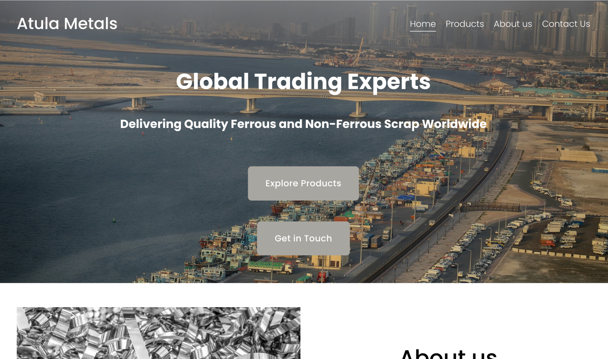
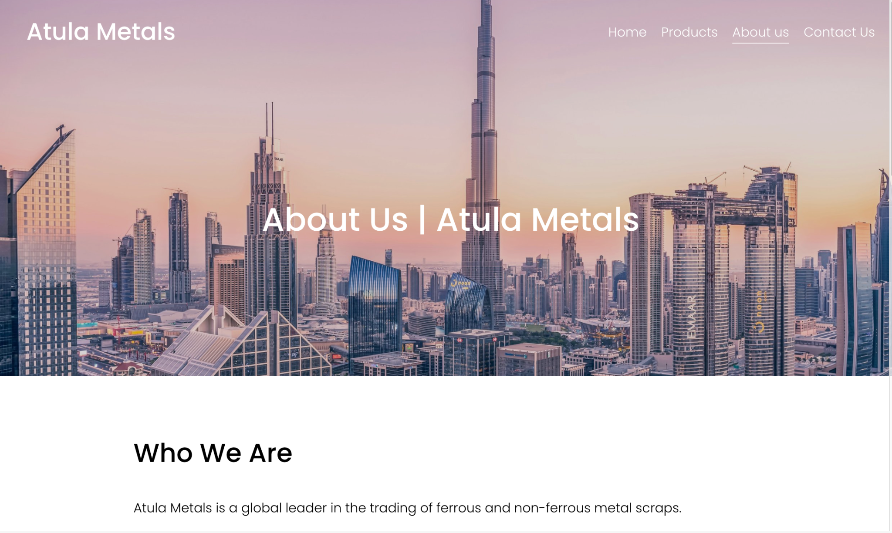
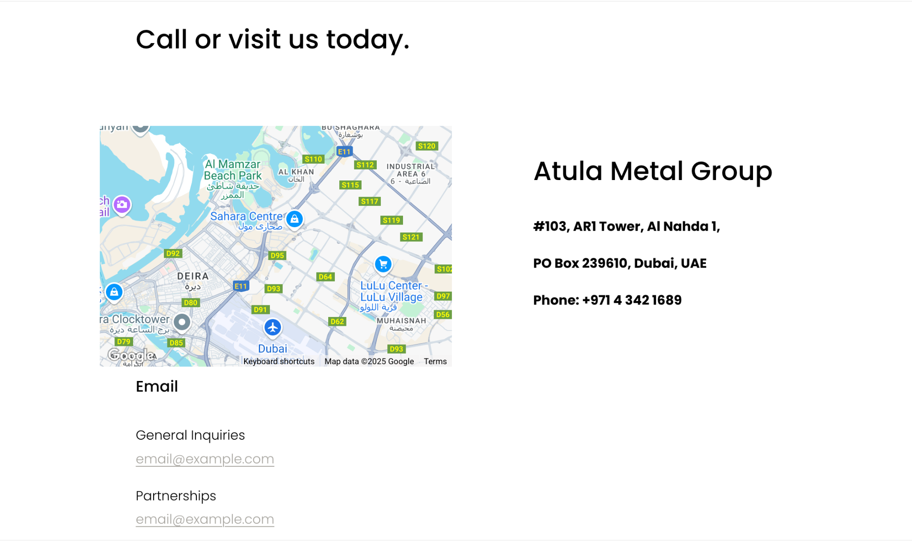

# Atula Metals Business Website

A sleek, minimal website built for a Dubai-based metal trading firm. Focused on structure, simplicity, and clean presentation.

### 🔧 Tools Used
- WordPress + Elementor
- Mobile optimization
- Contact + service sections

### 📦 Page Flow
- Home → Hero + services
- About → Company info
- Contact → Easy form + map
---

### 📸 Screenshots

#### Homepage Hero
  
*Homepage hero with global trade pitch and CTA buttons*

#### About Us
  
*About Us section with global credibility focus*

#### Contact Section
  
*Contact section with integrated Google Map and company info*

### 🎯 Outcome
Helped build trust and online visibility for a traditional B2B business stepping into digital.
