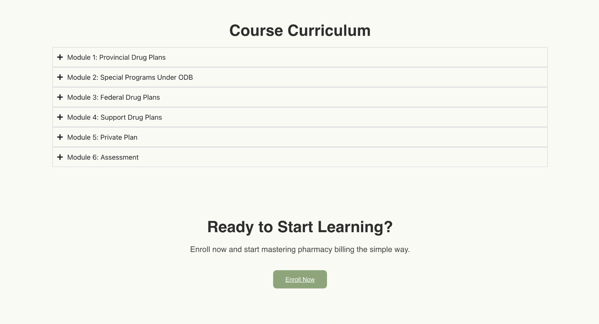
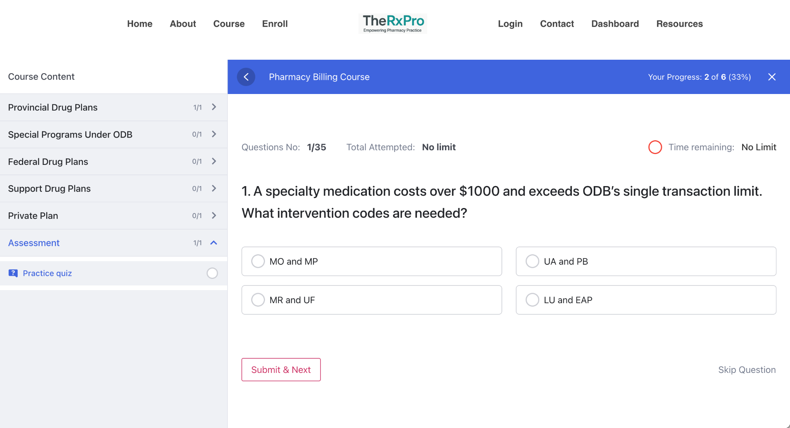

# Pharmacy Billing Course Website – TheRxPro

A custom WordPress website designed for an online Pharmacy Billing course. Built for ease of use, learning flow, and clean UX.

### 🔧 Tools Used
- WordPress + Elementor
- Tutor LMS
- WooCommerce
- HD Quiz
- AI Voiceover Integration

### 📦 Features
- 6-module course layout
- Student login + progress saving
- Practice quiz with scoring
- Custom animations + CTA flow
- Payment system setup for course access

  ---

### 📸 Screenshots

#### Homepage Hero
  
*Homepage hero with pitch, learning benefits,Background video, and CTA*

#### Course Curriculum
  
*Expandable module layout using Tutor LMS*

#### Practice Quiz
  
*Custom quiz interface with scoring and progress tracking*

### 🎯 Outcome
Helped the client launch a clean, functional education platform targeted at pharmacy professionals.
